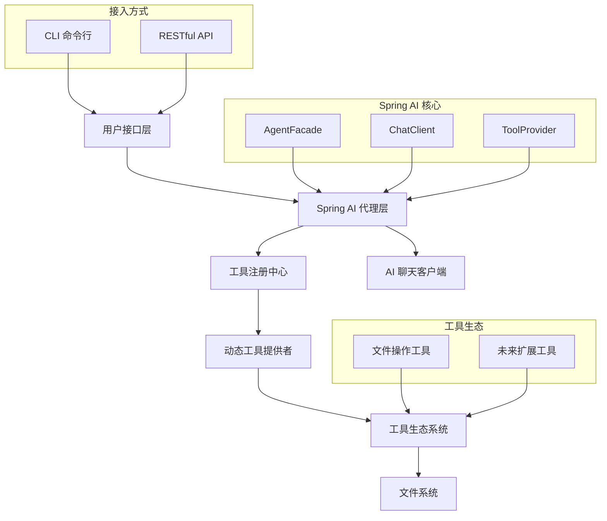

# Lang2File

<div style="text-align: center;">
  
  
  
  
</div>

## 项目概述

Lang2File 是一个基于 Spring Boot 的智能代理平台，通过自然语言交互实现文件系统操作。

### 核心特性

-  **AI 驱动的自然语言处理** - 支持智能对话式文件操作
-  **动态工具扩展机制** - 插件化架构，轻松扩展功能
-  **多接口访问** - 提供 CLI 命令行和 HTTP REST API

## ️ 架构设计

### 系统架构图



##  快速开始

### 环境要求

- Java 21 或更高版本
- Maven 3.8+
- Spring Boot 3.5.10
- 支持的 AI 模型提供商 API 密钥

### 安装步骤

1. **克隆项目**
```bash
git clone https://github.com/your-org/lang2file.git
cd lang2file
```

2. **配置环境变量**
推荐使用 `application-local.yml` 配置文件进行本地开发环境配置
```yaml
spring.ai.openai.api-key: <YOUR_OPENAI_API_KEY>
```

3. **编译构建**
```bash
mvn clean package -DskipTests
```

4. **运行应用**
```bash
# 开发模式运行
mvn spring-boot:run -Dspring-boot.run.profiles=dev

# 生产环境运行
java -jar target/lang2file-1.0.0.jar --spring.profiles.active=prod
```

### 使用示例

#### CLI 命令行模式

配置文件：`spring.shell.interactive.enabled`

#### RESTful API 调用
```bash
# 发送聊天请求
curl -X POST http://localhost:port/api/agent/chatText \
  -H "Content-Type: application/json" \
  -d '{"message": "帮我查看当前目录下的所有文件"}'
```

##  详细文档

### 配置指南

#### application.yml 核心配置

```yaml
developing...
```

## 许可证

Apache License 2.0 许可证 - 查看 [LICENSE](LICENSE) 文件了解详情。

## 致谢

- [Spring Boot](https://spring.io/projects/spring-boot)
- [Spring AI](https://github.com/spring-projects/spring-ai)
- [Spring Shell](https://spring.io/projects/spring-shell)
- [Lombok](https://projectlombok.org/)

---

<div style="text-align: center">
  Made with ❤️ by the Yuuine
</div>
